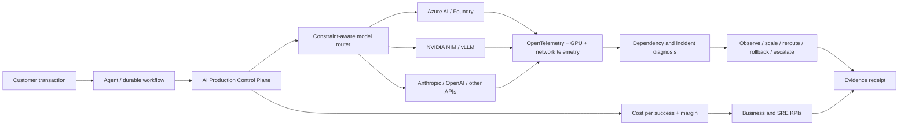

# Enterprise AI Production Control Plane

**Kubernetes GPU FinOps, LLM observability, agentic AI reliability, Azure AI, NVIDIA NIM and multicloud inference—connected to business outcomes.**

[](https://github.com/AAH20/enterprise-ai-production-control-plane/actions/workflows/ci.yml)
[](pyproject.toml)
[](LICENSE)

Enterprise AI fails in the gap between a successful model call and a successful business workflow. This project provides an executable, provider-neutral control plane that connects model selection, infrastructure telemetry, workflow quality, incidents and unit economics.

> Current evidence: the decision engine, API, scenarios and tests are implemented locally. Scenarios use synthetic inputs. Azure, Kubernetes, NVIDIA NIM and commercial model providers are deployment contracts until exercised in an authorized environment.

## The operational question

```text
Which model and infrastructure should execute this workflow now,
within quality, latency, residency and availability constraints,
and what business value remains after the full cost of success?
```

The control plane answers that question per workflow and emits a reproducible evidence receipt.

## Executable capabilities

- Selects the lowest-cost provider satisfying hard quality, latency and residency requirements.
- Excludes unavailable providers and produces a deterministic failover decision.
- Calculates token, infrastructure, retry, successful-workflow cost and realized margin.
- Diagnoses provider outage, GPU saturation, quality regression, latency breach and unclassified workflow failure.
- Marks high-impact remediation that requires human approval.
- Exposes `/health`, `/ready` and `/v1/evaluate` HTTP endpoints using the Python standard library.
- Produces SHA-256 tamper-evident receipts with explicit integrity limitations.
- Includes secure Kubernetes, Azure Bicep, CI and release-policy contracts.

## Architecture



See [architecture.md](docs/architecture.md) for production integrations and trust boundaries.

## Run locally

No third-party Python dependency is required.

```bash
PYTHONPATH=src python3 -m unittest discover -s tests -v
PYTHONPATH=src python3 -m aicontrol.cli examples/customer-support-gpu-saturation.json
PYTHONPATH=src python3 -m aicontrol.cli examples/provider-outage.json --output evidence/provider-outage.json
```

Start the API:

```bash
PYTHONPATH=src python3 -m aicontrol.api --port 8080
curl http://127.0.0.1:8080/health
curl -X POST http://127.0.0.1:8080/v1/evaluate \
  -H 'Content-Type: application/json' \
  --data @examples/customer-support-gpu-saturation.json
```

## Decision output

The GPU-saturation scenario produces:

- a feasible model and provider selected under declared constraints;
- estimated cost and expected margin;
- observed-provider economics kept separate from the projected routing decision;
- an incident diagnosis of GPU saturation;
- a `scale-or-reroute` remediation recommendation;
- a simulated-evidence label and integrity disclaimer.

No customer revenue, production GPU performance or cloud savings are claimed.

## Unit economics

```text
cost per successful workflow =
  model + GPU/CPU + data + retrieval + tools + network + observability + retries
  ---------------------------------------------------------------------------
       workflows meeting success, quality and latency thresholds

workflow margin = realized business value - full successful-workflow cost
```

The reference engine currently measures token, time-based infrastructure and retry costs. Tool, network and storage cost adapters are planned extension points. See [unit-economics.md](docs/unit-economics.md).

## KPI contract

| Layer | Production KPI |
|---|---|
| Business | realized value, margin, revenue at risk, automation yield |
| Agent | task completion, human escalation, retry and tool failure rates |
| Model | quality, evaluation pass rate, tokens and cost per success |
| Inference | TTFT, p95/p99 latency, throughput, KV-cache hit rate |
| Infrastructure | GPU allocation/utilization, queue time, network loss and saturation |
| Reliability | SLO attainment, error-budget burn, MTTD, MTTR and rollback success |
| Delivery | deployment frequency, change failure rate and evaluation regressions |

## Production integration map

| Capability | Reference integration | Status |
|---|---|---|
| Azure evidence plane | Log Analytics, Application Insights, ACR | Bicep contract |
| Runtime | AKS/EKS/GKE or on-prem Kubernetes | Kubernetes contract |
| GPU telemetry | NVIDIA DCGM Exporter / GPU Operator | adapter contract |
| Model serving | NVIDIA NIM, vLLM, Azure AI | provider contract |
| Tracing | OpenTelemetry | semantic contract |
| Durable execution | Temporal or LangGraph | workflow contract |
| Policy | OPA/Kyverno plus release gates | policy contract |
| Local proof | standard-library API and deterministic scenarios | implemented and tested |

## Evidence classes

- **Implemented:** executable code and automated tests exist.
- **Deployed:** evidence is captured from an authorized live environment.
- **Simulated:** deterministic synthetic inputs exercise a declared scenario.
- **Contract:** an integration boundary exists but has not called the real provider.

The repository never promotes simulated values into customer outcomes.

## Commercial use cases

- AI-platform assessment and unit-economics baseline.
- GPU and inference capacity optimization.
- Production agent reliability and observability program.
- Multicloud model-routing and provider-resilience implementation.
- Forward-deployed integration with CRM, ERP, payment and support workflows.
- Managed AI infrastructure, SRE and continuous optimization.

## Related systems

This flagship consolidates patterns from [AI Factory Revenue Twin](https://github.com/AAH20/ai-factory-revenue-twin), [Network Change Intelligence Twin](https://github.com/AAH20/network-change-intelligence-twin), [Enterprise AI Integration Platform](https://github.com/AAH20/enterprise-ai-integration-platform), [CompoundCloud AI Delivery Fabric](https://github.com/AAH20/compoundcloud-ai-delivery-fabric), [AIOps Observability Platform](https://github.com/AAH20/aiops-observability-platform) and [Real-Time Payment Fraud Platform](https://github.com/AAH20/real-time-payment-fraud-platform).

## Engage

Need to turn an AI pilot into a measurable, supportable production platform?

[Request an AI infrastructure and unit-economics review](https://a2zsoc.com/contact?topic=ai-production-control-plane&utm_source=github&utm_medium=repository).
